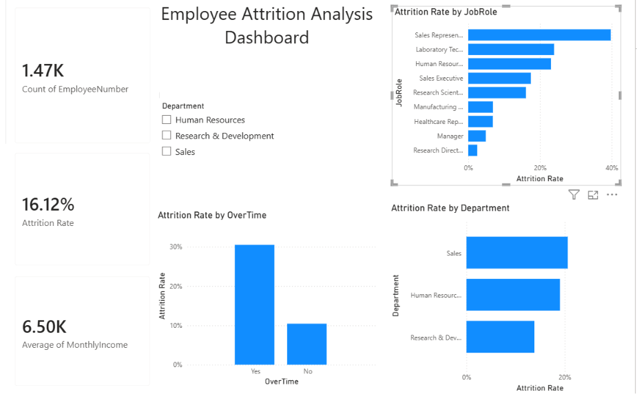

# Employee Attrition Analysis Dashboard

## Project Overview
Analysis of IBM HR Analytics dataset to identify key factors driving employee attrition using Python and Power BI.

## Tech Stack
- Python (Pandas, NumPy)
- Power BI
- VS Code

## Dataset
- Source: IBM HR Analytics Employee Attrition Dataset (Kaggle)
- Records: 1,470 employees | 35 features

## Key Findings
- Overall Attrition Rate: 16.12%
- Sales Representative role has highest attrition: 39.76%
- Employees doing OverTime have 30.53% attrition vs 10% without OverTime
- Sales Department has highest attrition: 20.63%
- Avg Monthly Income of employees who left: ₹4,787 vs ₹6,832 who stayed

## Dashboard Preview

## Files
- `analysis.py` - Python analysis code
- `processed_hr_data.csv` - Cleaned dataset used in Power BI
- `HR_Attrition_Dashboard.pbix` - Power BI dashboard file
